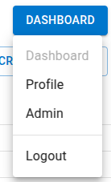
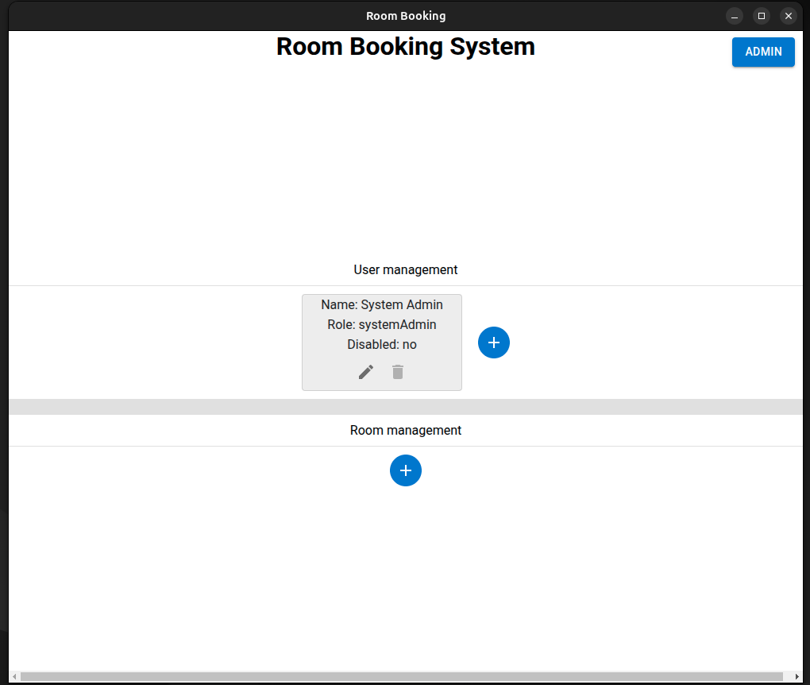
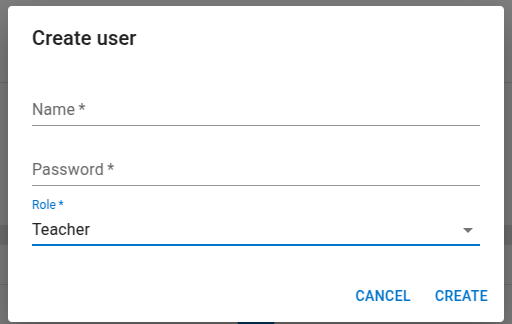
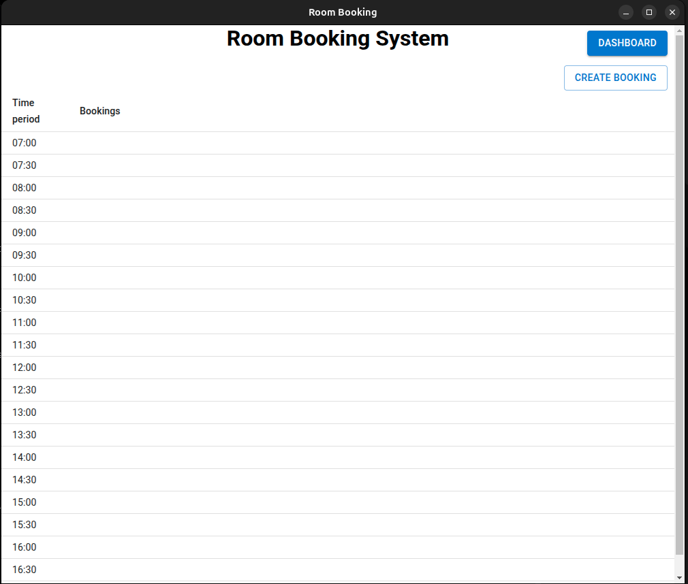
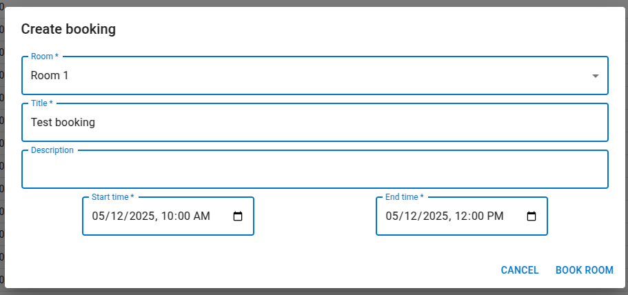

# Room booking app

## User Guide:

After starting the app for the first time, you should see something like this:

{ width=50% }

### Student/guest:

*As a student/guest you can't do much with the app besides seeing the bookings for the current day.*

### Admins:

For teachers and admins to be able to more, they need to login, which can be done through the login button in the top right of the app.

*On a fresh setup there only exists one user, which is the system admin user*

System admin login info:

* The user name: `System Admin`
* The password: `Merc1234!`

The system admin is similar to admins, but can only create new users.  
To Create new users go to the Admin page, which can be found in the navigation menuin the top right of the app:

{ height=20% }

After navigating to the admin page, you should see a page like this:

{ width=50% }

To create a new user, click on the plus button in the user management section.  
This will open a dialog where you can create a new user:  
*The password can be changed later by the user.*

{ width=50% }

After creating an admin user, you can log out, and log back into the admin user, which then can make rooms, in the room mangement section of the admin page, it is similar to the user management section.

### Teachers:

*Admins can also do everything a teacher can*

The teachers can only work with bookings.

This is done on the main page:

{ width=50% }

When pressing the create booking button, it opens a dialog, where teachers can create a new booking for a room.

{ width=50% }

Once a room is booked it will appear on the main dashboard, for all to see.

{ width=50% }
