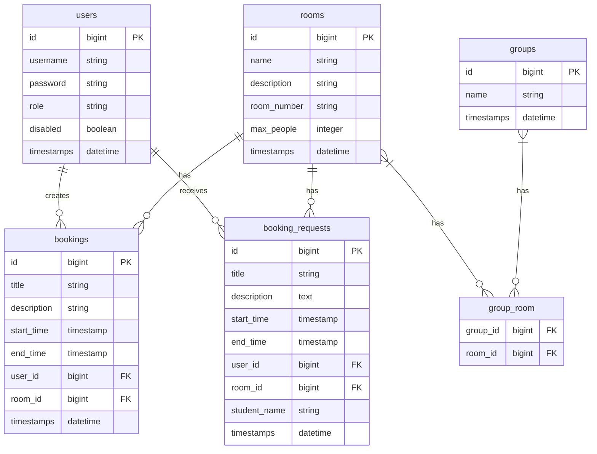

# Database diagram

```mermaid
erDiagram
    users ||--o{ bookings : creates
    users ||--o{ booking_requests : receives
    rooms ||--o{ bookings : has
    rooms ||--o{ booking_requests : has
    rooms }|--o{ group_room : has
    groups }|--o{ group_room : has

    users {
        id bigint PK
        username string
        password string
        role string
        disabled boolean
        timestamps datetime
    }

    rooms {
        id bigint PK
        name string
        description string
        room_number string
        max_people integer
        timestamps datetime
    }

    bookings {
        id bigint PK
        title string
        description string
        start_time timestamp
        end_time timestamp
        user_id bigint FK
        room_id bigint FK
        timestamps datetime
    }

    booking_requests {
        id bigint PK
        title string
        description text
        start_time timestamp
        end_time timestamp
        user_id bigint FK
        room_id bigint FK
        student_name string
        timestamps datetime
    }

    groups {
        id bigint PK
        name string
        timestamps datetime
    }

    group_room {
        group_id bigint FK
        room_id bigint FK
    }
```
