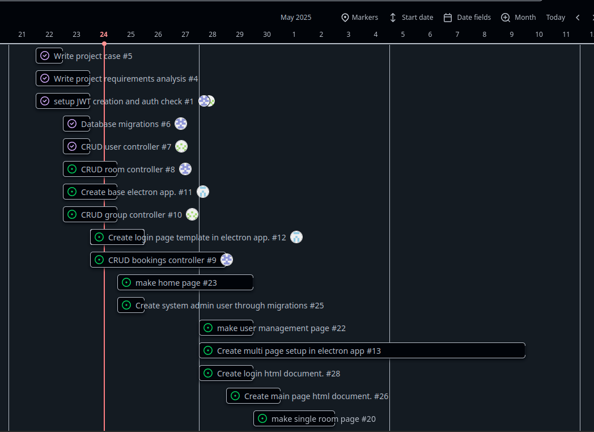
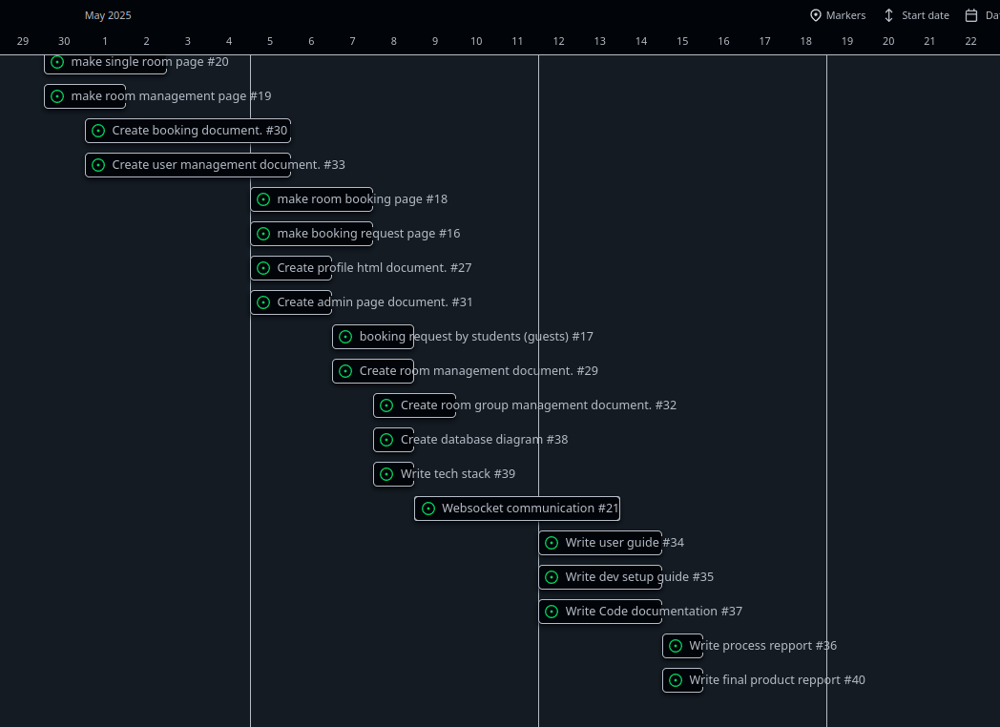
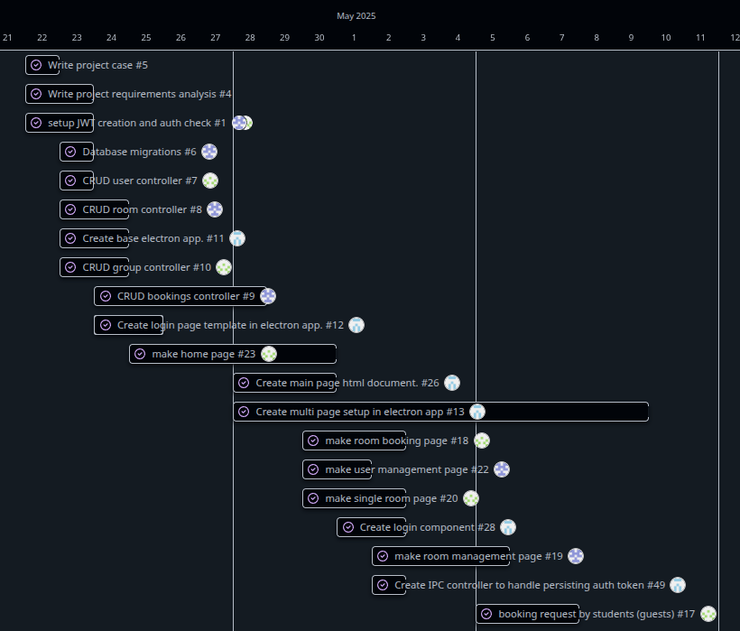
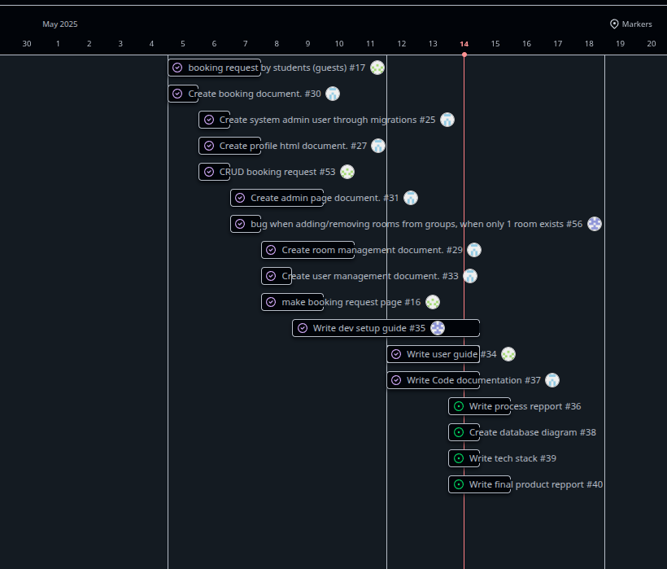

# Process Report

## Estimated timeplan

{ width=50%}

{ width=50%}

---

## Actual timeplan

{ width=50%}

{ width=50%}

---

## Logbooks

### KKL Logbook

#### 22-04-2025
- Helped creating case
- Created laravel project
- Created auth controller
- Make system use jwt tokens

#### 23-04-2025
- Created migrations
- Created CRUD room controller

#### 24-04-25 -> 28-04-25
- Fixed a git merge conflict
- Created CRUD booking controller

#### 29-04-25
- Start making user management on the app

#### 30-04-25
- Continuing making user management in webside

#### 1-5-25
- Continuing making user management

#### 2-5-25
- Start making room group management in webside

#### 5-5-25
- Continuing making room group management

#### 6-5-25
- Make the resource manager with crud

#### 7-5-25
- Add help functions to resource manager

#### 8-5-25
- Merged add / remove rooms to group's modal

#### 9-5-25
- Start making the dev setup guide

#### 12-5-25 and 13-5-25
- Continue making the dev setup guide

#### 14-5-25
- Start making the backend code documentation

#### 15-5-25
- Continue making the backend code documentation

#### 16-5-25
- Help with the final documentation

---

### JNJ Logbook

#### 22-04-2025
- Helped creating case
- Created laravel project
- Created auth controller
- Make system use jwt tokens

#### 23-04-2025
- Created migrations
- Created CRUD room controller

#### 24-04-25 -> 28-04-25
- Fixed a git merge conflict
- Created CRUD booking controller

#### 29-04-25
- Start making user management on the app

#### 30-04-25
- Continuing making user management in webside

#### 1-5-25
- Continuing making user management

#### 2-5-25
- Start making room group management in webside

#### 5-5-25
- Continuing making room group management

#### 6-5-25
- Make the resource manager with crud

#### 7-5-25
- Add help functions to resource manager

#### 8-5-25
- Merged add / remove rooms to group's modal

#### 9-5-25
- Start making the dev setup guide

#### 12-5-25 and 13-5-25
- Continue making the dev setup guide

#### 14-5-25
- Start making the backend code documentation

#### 15-5-25
- Continue making the backend code documentation

#### 16-5-25
- Help with the final documentation

---

### KRC Logbook

#### 22-04-2025

- Wrote project case.
- Began writing initial requirememts for project.
- Setup initial github repo.
- Planning tasks for project.

#### 23-04-2025

- Continued writing on product repport.
- Started to setup electron app.

#### 24-04-2025

- Created estimated timeplan based on current planned tasks.
- Continued setting up electron app.

#### 25-04-2025

- Started work on login page.
- Setup React and Material UI, to make it easier to handle multi page setup.
- Started creating basic components.

#### 28-04-2025

- Created resource manager in electron app.
- Started work on default room booking overview page.

#### 29-04-2025

- Worked on room booking overview page.
- Fixed some issues related to networking in electron.

#### 30-04-2025

- Finished work on initla room booking overview page. 

#### 01-05-2025

- Created login dialog.
- Created multi page setup.
- Started working on a IPC controller.

#### 02-05-2025

- Finished creating IPC controller.
- Setup auto login on startup.

#### 05-05-2025

- Created Booking dialog.
- Changed login to not logout existing user sessions.
- Refactored booking ordering in app view.
- Fixed minor issue with logout failing.

#### 06-05-2025

- Created system admin user migration.
- Created simple profile page.

#### 07-05-2025

- Started working on admin page.
- Had some troubles with focus, so didn't get much done.

#### 08-05-2025

- Created user management section on admin page.
- Removed left over code in password dialog.
- Started work on room management section in admin page.

#### 09-05-2025

- Continued work on room management section.
- Played Bingo with H1, and won.

#### 10-05-2025

- Finalizedd room management.
- Updated backend validation for update and create room endpoints, to allow empty description.

#### 12-05-2025

- Started work on code documentation.
- Created app user guide, for electron app.

#### 13-05-2025

- Continued working on code documentation for electron app.

#### 14-05-2025

- Finished working on code documentation.
- Meeting with group to work on finalizing product repport.
- Added missing features from electron app, to missing features file.
- Created initial structure for process report.
- Added tech stack and database diagram.

#### 15-05-2025

- Worked on product repport.

#### 16-05-2025

- Worked on process repport.

---

## Conclusion

We have achieved most of our goals, in making the room booking system.  
There are still some features we haven't fully implemented, in both the app and website.  
Originally we wanted to have the electron app, contain all features related to teachers and admins, but to make sure that we had enough tasks, we decided that all features should be made on both the app and website, it also makes more sense to have all features available on both the app and website.

We ran out of time, to fully implement all features, some of the missing features are:
    - Editting bookings.
    - Recurring bookings.
    - viewing all bookings for different days.
