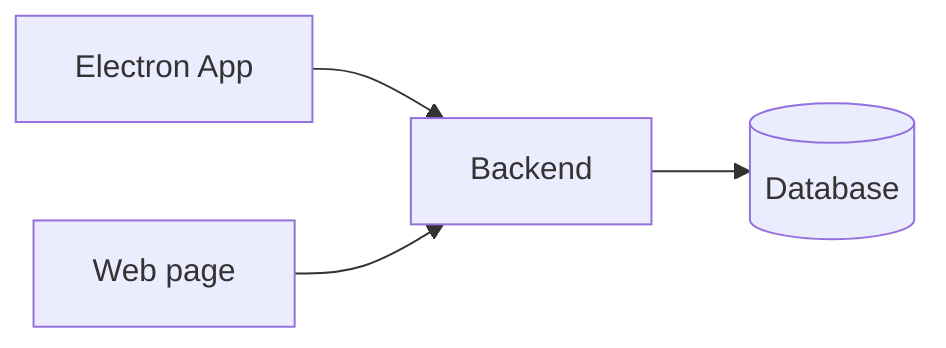
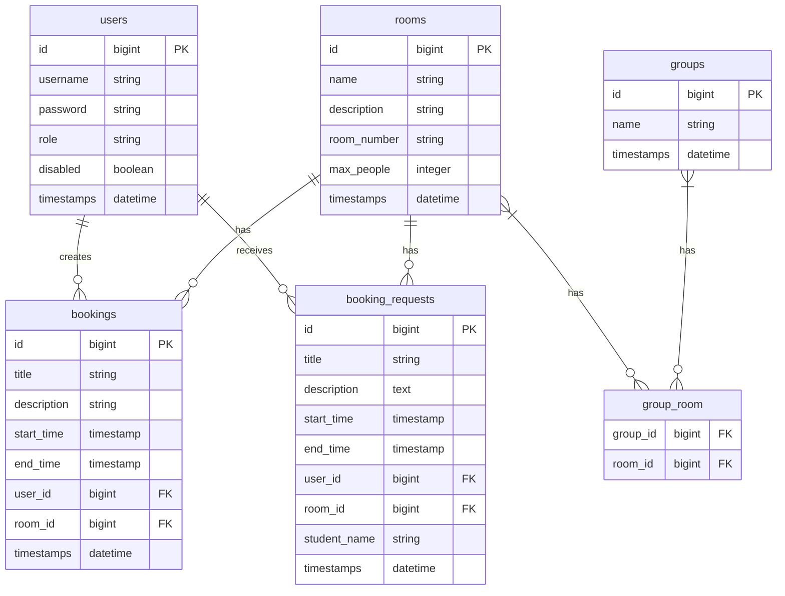
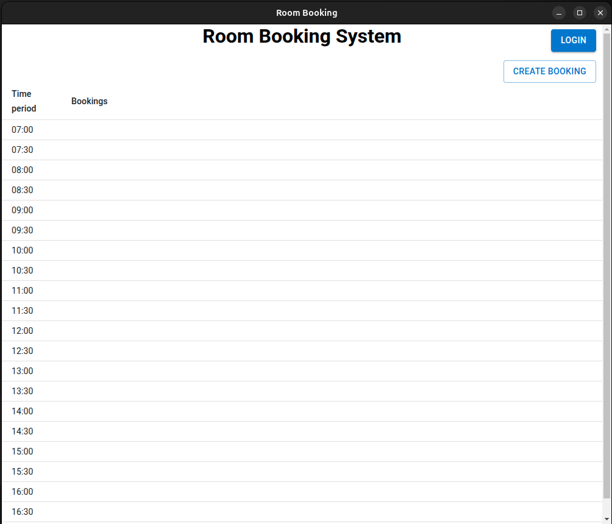
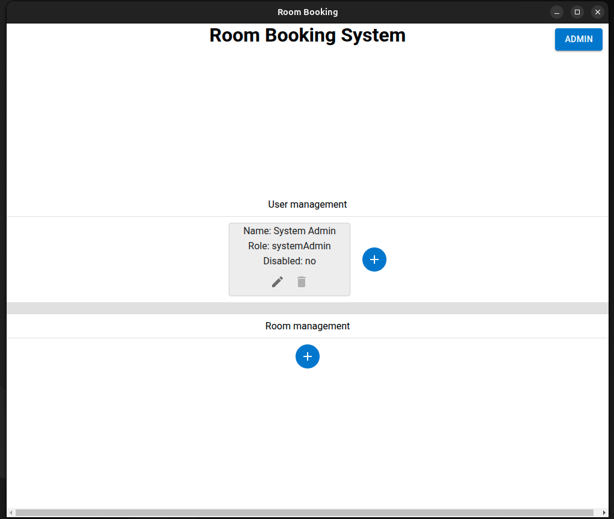
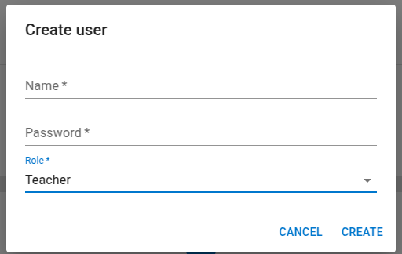
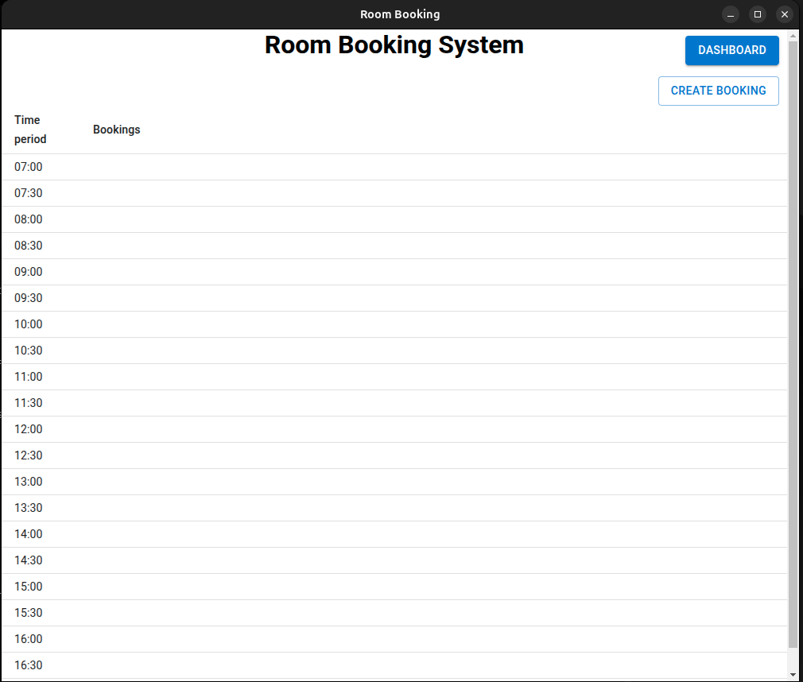
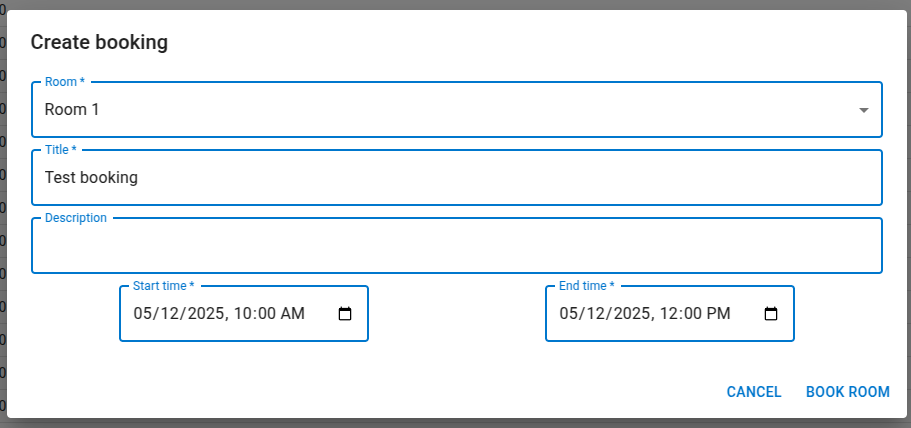
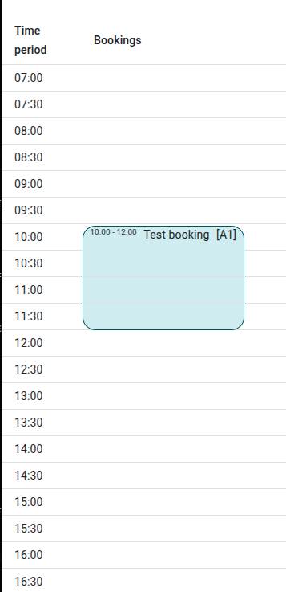

# Project Overview

The Room Booking System is a comprehensive solution designed to streamline classroom and meeting room management in educational institutions. It consists of three main components:

- A web-based interface for students and guests to view room availability and submit booking requests
- A desktop application for teachers and administrators to manage bookings and rooms
- A backend API service that handles all data management and business logic

The system accommodates three distinct user roles:

- Students/Guests: Can view room schedules and submit booking requests without requiring an account
- Teachers: Can create and manage their own room bookings and handle student booking requests
- Administrators: Have full system access including user management, room configuration, and booking oversight

# Functional requirements:

## User roles:

System admin:

- Can create admin users 
- Requires login.

Admin:

- Can do everything a teacher can do.
- Can create new users.
    - assign either admin or teacher role to user.
- Can update users.
- Can delete users.
    - Can't delete system admin.
    - Can't delete the current user.
- Can disable users.
    - Can disable the system admin user.
    - Can't disable the current user.
    - This only disables the users login, and de authorize them.
- Can re enable users.
    - Can re enable the system admin user.
- Can create rooms.
- Can update rooms.
- Can delete rooms.
- Can create room groups.
- Can update room groups.
- Can delete room groups.
- Can update and delete all bookings.
- Requires login.

Teacher:

- Can do everything a student can do.
- Can update own user profile.
    - Change username.
    - Change password.
- Can create bookings.
- Can update bookings.
    - Only bookings that they have created.
- Can delete bookings.
    - Only bookings that they have created.
- Requires login.

Student (Guest):

- Can view bookings
- Doesn't need login.
- Can request room booking.

## User management:

- Profile view:
    - Option for changing password.

- User management view:
    - Only visible to admins.
    - Option to create new users.
        * users can have either admin, or teacher role.
    - Option to update user roles.
        * Can't update current user role.
        * Can't update system admin user.
    - Option to to delete users.
        * Can't delete current user.
        * Can't delete system admin user.
    - Option to disable users.
        * Can disable the system admin user.
        * Can't disable the current user.
        * This only disables the users login, and de authorize them.
    - Option to re enable users.
        * Can re enable the system admin user.
    

## Rooms:

- Room management view:
    - Contains a list of all rooms.
    - Shuold have options for admin users to:
        * Create rooms, must include the following:
            - Name.
            - Room id. This is used on the bookings.
            - Description.
            - Size.
        * Update rooms.
        * Delete rooms.

- Group management view:  
    - Groups are only to sort rooms.  
    - Contains a list of all room groups.
    - Shuold have options for admin users to:
        * Create groups.
        * Update groups.
        * Delete groups.
        * Add rooms to a group.

## Bookings:

- Templates for default page design.
- Day view:
    - Shows all rooms and their bookings.
- Week view:
    - Shows all bookings in the current week for a specific room.

- Custom time duration view: 
    - Shows all bookings in the time duration for a single room.

- Bookings should have custom booking durations.
    - The min. duration is 5 minutes.
    - The max. duration is to the end of the current day.

- Create booking view:
    - A booking must include: 
        * A title.
        * Who created it.
        * Which room it is for.
        * start time.
    - A booking can include:
        * recurring interval.
        * A description.
        * end time, if it's not provided then it goes to the end of the current day.

- Details view:
    - When a user clicks on a booking, it opens the details view.
    - Contains all info that have been entered during creation.
    - If the teacher who created it, or an admin opens the details view, then there should be an edit icon to allow updating the booking.

## Web page:

- Should contain views relevant for students/guests.
- Should have a login option for teachers and admins.
- Should contain pages for teachers and admins to easily manage bookings and other parts of the room booking system.

## App:

- Should contain views relevant for students/guests.
- Should have a login option for teachers and admins.
- Should contain pages for teachers and admins to easily manage bookings and other parts of the room booking system.

## Nice to have features:

- Websocket communication, so that when a change is made, then all devices are notified about the change and can refresh

---

# Missing Features

## Frontend Website

### Functional Improvements

- **Edit Bookings**  
  Allow users (e.g., teachers) to modify existing bookings instead of deleting and recreating them.

- **Recurring Bookings**  
  Enable support for repeating reservations (e.g., weekly classes, monthly meetings).

### Known Issues / Bugs

- **Invalid Token Handling**  
  Doesn't automatically log out users if an `authToken` exists in localStorage but is no longer valid (e.g., expired or revoked).

- **Static Booking Length Visualization**  
  Currently, bookings are shown with a default height/length based only on their start time.  
  The visual display should **scale to reflect the actual duration** of each booking (e.g., a 2-hour booking should look longer than a 30-minute one).

## App

### Functional improvements

- **Edit bookings**
  Allow teachers to update existing bookings.

- **Recurring bookings**
  Option for defining bookings as recurring, and interval of recurring.

- **Room group management**
  This feature exist on the website, but haven't been ported to the app.

- **Booking requests**
  This feature exist on the website, but haven't been ported to the app.

- **Web socket communication**
  Allow updates to bookings or rooms, to be sent to all other instances of the app, without needing to have a loop running at a set interval.

---

# Domain model:



---

# Database model:



---

# Tech stack

## Backend

- [PHP](https://www.php.net/)
- [Laravel framework](https://laravel.com/)

## Website

- [Laravel blade templates](https://laravel.com/docs/12.x/blade)

## App

- [Typescript](https://www.typescriptlang.org/)
- [React](https://react.dev/)
- [Electron](https://www.electronjs.org/)

---

# Dev setup guide (Kasper K)

### Requirements

- php 8.3.x NTS (Not Thread Safe)
- Composer
- MariaDB or MySql
- Npm
- Node

### Git clone

- Repository: <https://github.com/krc-coding/h5-lokale-booking>
- As a dev:
    - Clone the project
- As a normal user
    - Download the zip

## Api and webside

### Setup

1. Install composer in project
    - Open a terminal and navigate to the project
    - After navigate to `/RoomBookingSystem`
    - Run: `composer install`

2. Make env
    - In a terminal run in order:
        * `cp .env.example .env`
        * `php artisan key:generate`
    - Update your DB settings in env to fit your database

3. Database
    - Create a new database with the same name as you used in your env
    - In the terminal run:
        * `php artisan migrate`
        * `php artisan passport:client --personal`

4. Start web sever / backend
    - Run: `php artisan serve`

## App

### Pre request

*The backend api server is required for the app to work correctly.*

### Setup

1. Install dependencies
    - Open a terminal and navigate to the project
    - navigate to: `/RoomBookingApp`
    - Run: `npm ci`

2. Start app
    - Run: `npm start`

---

## Additionally development tool

### Api

- Postman.
- There are a postman collection:  
`RoomBookingSystem\H5 - Room Booking.postman_collection.json`

---

# Room Schedule & Booking System – User Guide for website (Jonas N)

## Introduction

Welcome to the Room Booking System. This platform helps students, teachers, and administrators manage room availability and usage.

There are three user types, each with different responsibilities:

- **Students**: Can view schedules and request room bookings without needing an account.
- **Teachers**: Can log in to book rooms and manage booking requests submitted by students.
- **Admins**: Have full access to manage rooms and teacher accounts.

System admin login info:

* The user name: `System Admin`
* The password: `Merc1234!`

The system admin is similar to admins, but can only create new users.  
> **Note:** the system admin is needed to create the initial admin account and should be dissabled after

---

## Student Guide

### What Students Can Do

- View room availability and schedules.
- Filter bookings by date range (on room pages).
- Submit room booking requests (from individual room pages).

### Viewing Room Schedules

There are **two types of schedules** available in the system:

### Home Page – All Rooms (Current Day)

- When you first open the site, you will see a **list of all bookings for today across all rooms**.
- Each booking includes:
  - Room name
  - Title
  - Time
- This is useful for quickly checking what’s currently booked.

> **Note:** You cannot submit booking requests from the homepage.

### Room Page – Single Room (Custom Dates + Booking)

- Click on the **view all rooms** button and then on a room name to access its dedicated schedule page.
- You can:
  - View bookings for a **custom date range**
  - See detailed daily schedules
  - Submit a booking request for that room
- Use the **"From"** and **"To"** date inputs, then click **Apply** to update the schedule view.

### Booking a Room (from Room Page)

1. Click **"Book This Room"** on the room's page.
2. Fill in the required fields:
   - Title
   - Description
   - Start & End Time
   - Teacher
   - Your name
3. Submit the form.
4. Your request is sent to a teacher for review.

> **Note:** Students do **not** need an account to submit requests. You will **not receive a notification**, so follow up if needed.

---

## Teacher Guide

### Logging In

- Click the **Login** button in the top right.
- Enter your credentials to access your teacher account.

### Change Your Password

- After logging in, go to **User Management**.
- There, you can update your password.
> It is **strongly recommended** to change your password upon first login, since your account was created by an admin.

### Booking a Room Directly

1. Go to any room’s schedule page.
2. Click **"Book This Room"**.
3. Fill out the booking form and submit — your booking is **confirmed immediately**.

### Managing Booking Requests

1. Click **"Booking Requests"** after logging in.
2. View student-submitted booking requests assigned to you.
3. For each request:
   - Review the title, student name, room, time, and description.
   - Click **Approve** or **Deny**.
4. The schedule updates automatically for approved bookings.

> Denied requests are discarded and won’t appear in the schedule.

---

## Admin Guide

### Logging In

- Click **Login**, then use your admin credentials.

### User Management

- Click **"User Management"** to:
  - Create new teacher accounts
  - Disable or delete existing teacher accounts

### Room/Group Management

- Click **"Room/Group Management"** to:
  - Add new rooms or room groups
  - Edit descriptions and details
  - Remove rooms no longer in use

### Booking Requests

- Admins can view **all** booking requests.
- They can also **approve or deny** requests on behalf of teachers, if needed.

---

## Authentication Details

- Logged-in users are authenticated via `authToken` stored in **localStorage**.
- The interface updates based on login state:
  - You’ll see either a **Login** or **Logout** button.
  - If logged in, you will also see other relevant buttons.
- Clicking **Logout** clears the token and returns you to the homepage.

---

## Troubleshooting

### "No bookings" appears even though I submitted one  
- Your booking might be **pending teacher approval**.

### Booking form won’t submit  
- Ensure all required fields are filled.
- Check that your start and end times are valid.

### Admin/teacher buttons are missing  
- You may not be logged in.
- Your session might have expired — try logging in again.

---

## FAQ

**Q: Can students cancel or modify their booking requests?**  
A: No. Students must contact a teacher to request changes or resubmit a new request.

**Q: Can a teacher book a room already booked by someone else?**  
A: No. The system prevents double bookings and will show a conflict error.

**Q: What happens when a booking is denied?**  
A: The request is removed.

**Q: How long does it take for a booking request to be approved?**  
A: This depends on how quickly the assigned teacher responds. There is no auto-approval.

---

## Final Notes

- Keep date ranges small when filtering schedules to improve performance.
- Always log out after using the system on shared or public computers.
- For technical issues, contact your IT administrator.

---

# Room booking app - User Guide for app (Kasper R)

## User Guide:

After starting the app for the first time, you should see something like this:

{ width=50% }

### Student/guest:

*As a student/guest you can't do much with the app besides seeing the bookings for the current day.*

### Admins:

For teachers and admins to be able to do more, they need to login, which can be done through the login button in the top right of the app.

*On a fresh setup there only exists one user, which is the system admin user*

System admin login info:

* The user name: `System Admin`
* The password: `Merc1234!`

The system admin is similar to admins, but can only create new users.  
To Create new users go to the Admin page, which can be found in the navigation menuin the top right of the app:

{ height=20% }

After navigating to the admin page, you should see a page like this:

{ width=50% }

To create a new user, click on the plus button in the user management section.  
This will open a dialog where you can create a new user:  
*The password can be changed later by the user.*

{ width=50% }

After creating an admin user, you can log out, and log back into the admin user, which then can make rooms, in the room mangement section of the admin page, it is similar to the user management section.

### Teachers:

*Admins can also do everything a teacher can*

The teachers can only work with bookings.

This is done on the main page:

{ width=50% }

When pressing the create booking button, it opens a dialog, where teachers can create a new booking for a room.

{ width=50% }

Once a room is booked it will appear on the main dashboard, for all to see.

{ width=50% }

---

# Code documentation (Kasper K)

*This documents some of the more complex/interesting parts of the backend*

## Prerequisites

The code docs are written, with the assumption of some basic knowlegde in the following area:

* Php

## Booking controller

The code for the following can be found in  
`RoomBookingSystem\app\Http\Controllers\BookingController.php`.

### Create booking

First it make sure what it is a admin or teacher there is logged in.
Then validates it all the data, end_time is nullable if it is set it to the end of the day.
Then it checks if the room is booked in the time the new booking is.
Returns the new booking if successful else a message.

```php 
public function createBooking(Request $request)
{
    $user = auth()->user();
    if ($user->role !== 'admin' && $user->role !== 'teacher') {
        return response()->json(['message' => 'Forbidden'], 403);
    }

    $validated = $request->validate([
        'title' => 'required|string',
        'description' => 'nullable|string',
        'start_time' => 'required|date',
        'end_time' => 'nullable|date|after_or_equal:start_time',
        'room_id' => 'required|exists:rooms,id'
    ]);

    if ($request->end_time == null) {
        $validated['end_time'] = Carbon::parse($validated['start_time'])->endOfDay();
    }

    // It finds the room and checks if it's not overlapping
    $overlap = Booking::where('room_id', $validated['room_id'])
        ->where(function ($query) use ($validated) {
            // Checks if the booking is with in one of the allready existing bookings 
            $query->whereBetween('start_time', [$validated['start_time'], $validated['end_time']])
                ->orWhereBetween('end_time', [$validated['start_time'], $validated['end_time']])
                ->orWhere(function ($query) use ($validated) {
                    // Checks if the booking completely overlap another booking
                    $query->where('start_time', '<=', $validated['start_time'])
                        ->where('end_time', '>=', $validated['end_time']);
                });
        })
        ->exists();

    if ($overlap) {
        return response()->json(['message' => 'This time slot is already booked.'], 400);
    }

    $booking = Booking::create([
        'title' => $validated['title'],
        'description' => $validated['description'] ?? null,
        'start_time' => $validated['start_time'],
        'end_time' => $validated['end_time'],
        'user_id' => $user->id,
        'room_id' => $validated['room_id'],
    ]);

    return new BookingResource($booking);
}
```

## Group controller

The code for the following can be found in  
`RoomBookingSystem\app\Http\Controllers\GroupController.php`.

### Create group

You can send an array of room ids and after creating the group making the ralation.

```php
public function createGroup(Request $request)
{
    $user = auth()->user();

    if ($user->role !== 'admin') {
        return response()->json(['message' => 'Unauthorized'], 401);
    }

    $validated = $request->validate([
        'name' => 'required|string|max:255',
        'room_ids' => 'array',
        'room_ids.*' => 'exists:rooms,id'
    ]);

    $group = Group::create([
        'name' => $validated['name'],
    ]);

    if (!empty($validated['room_ids'])) {
        $group->rooms()->sync($validated['room_ids']);
    }

    return response()->json($group->load('rooms'), 201);
}
```

## Room controller

The code for the following can be found in  
`RoomBookingSystem\app\Http\Controllers\RoomController.php`.

### Show room

Take a room id and find the room, returns the html from:  
`RoomBookingSystem\resources\views\singleRoom.blade.php`, after running all the php code.

```php
public function showRoom($id)
{
    $room = Room::with('bookings')->findOrFail($id);
    return view('singleRoom', compact('room'));
}
```

### Delete room

Check user as only admin can delete.
Then if there are booking to the room it can't delete.
Returns an empty json.

```php
public function deleteRoom(Room $room)
{
    $user = auth()->user();
    if ($user->role !== "admin") {
        return response()->json(["message" => "Unauthorized"], 401);
    }

    if ($room->bookings()->exists()) {
        return response()->json(['message' => 'Room still has booking'], 409);
    }

    $room->delete();
    return response()->json([], 204);
}
```

## Api routes

The code for the following can be found in  
`RoomBookingSystem\routes\api.php`.

### Routes

The prefix make all routes below have that syntax, in this case: `baseUrl/api/booking`.

Middleware are where you need to have a valid bearer token, it doesn't change url.

The first string is the final part of the url.
Next comes the class, it tells witch class where the function in the second string.

```php
Route::prefix('booking')->group(function () {
    Route::get('', [BookingController::class, 'getAllBookings']);
    Route::get('/{booking}', [BookingController::class, 'getSingleById']);
    Route::get('/room/{room}', [BookingController::class, 'getByRoomId']);

    Route::middleware('auth:api')->group(function () {
        Route::post('/create', [BookingController::class, 'createBooking']);
        Route::put('/update/{booking}', [BookingController::class, 'updateBooking']);
        Route::delete('delete/{booking}', [BookingController::class, 'delete']);
    });
});
```

## Resources

The code for the following can be found in  
`RoomBookingSystem\app\Http\Resources\BookingResource.php`.

This is what you want to you if want to filter in the data you want to send the user, this make an 1 to 1 of the data. 

```php
public function toArray(Request $request): array
{
    return parent::toArray($request);
}
```

This is an example on what you can do with a Booking:

```php
public function toArray(Request $request): array
{
    return [
        'id' => $this->id,
        'title' => $this->title,
        'description' => $this->description,
    ];
}
```

## Migraions

### Group and room ralation table

The code for the following can be found in  
`RoomBookingSystem\database\migrations\2025_04_23_062905_create_rooms_groups_table.php`.

It makes two rows with an foreign key.

```php
public function up(): void
{
    Schema::create('group_room', function (Blueprint $table) {
        $table->foreignId('group_id')->constrained();
        $table->foreignId('room_id')->constrained();
    });
}
```

### Default user

The code for the following can be found in  
`RoomBookingSystem\database\migrations\2025_05_06_063628_create_system_admin_user.php`.

This is the system admin creation and the only place where a user can get an other role then Admin and Teacher.

```php
public function up(): void
{
    $user = User::find(1);
    if (!$user) {
        User::create([
            'id' => 1,
            'username' => 'System Admin',
            'password' => Hash::make('Merc1234!'),
            'role' => 'systemAdmin',
        ]);
    }
}
```

---

# Code Documentation for Room Booking System (Jonas N)

This documentation describes the implementation details of a time-based booking grid web interface, including the **home page**, **booking requests page**, and **single room page**.

---

## Home Page (Room Booking System)

### Initial Setup

The room grid and associated time slots are dynamically populated using JavaScript. Data is passed as JSON from Blade templates:

```js
const rooms = @json($rooms->values());
const bookingsByRoom = @json($rooms->mapWithKeys(fn($r) => [$r->id => $r->bookings]));
```

- `rooms`: Contains all available rooms.
- `bookingsByRoom`: Mapping of room IDs to their respective bookings.

---

### Time Slot Rendering

Time slots from 00:00 to 24:00 are displayed at 30-minute intervals.

```js
for (let h = startHour; h < endHour; h++) {
    for (let m = 0; m < 60; m += interval) {
        ...
    }
}
```

- `startHour` / `endHour`: Define the range (00:00 - 24:00)
- `interval`: 30-minute interval
- `formatTime()`: Formats times (e.g., 08:00)
- `parseTimeOnly()`: Converts datetime to minutes since midnight

---

### Booking Block Placement

Each booking is rendered dynamically based on its start time:

```js
if (b.start >= slotStart && b.start < slotEnd) {
    const block = document.createElement('div');
    block.className = 'booking-block';
    ...
}
```

- Bookings are shown only at their starting slot.
- Multi-slot support is not implemented.

---

### Token Handling and UI

UI elements adapt based on authentication status:

```js
window.onload = function() {
    const token = localStorage.getItem('authToken');
    if (token) {
        authButton.textContent = 'Logout';
        ...
    }
};
```

- Logged-in users see Logout and management buttons.
- Guests see only the Login button.

---

## Booking Requests Page

### Fetching and Rendering Requests

Booking requests are fetched based on user role and rendered dynamically:

```js
async function fetchBookingRequests() {
    const res = await fetch(endpoint, { headers: { 'Authorization': `Bearer ${token}` } });
    const requests = await res.json();
    ...
}
```

- `endpoint` is chosen based on user role (admin/teacher)
- Requests are shown using a card-style UI

---

### Approve and Deny Actions

Users can approve or deny requests using API calls:

```js
async function handleAction(action, id) {
    const url = action === 'delete'
        ? `/api/bookingRequest/delete/${id}`
        : `/api/bookingRequest/approve/${id}`;
    const method = action === 'delete' ? 'DELETE' : 'POST';
    ...
}
```

- `approve-btn`: Calls approve endpoint
- `deny-btn`: Calls delete endpoint
- UI updates after each action

---

## Single Room Page

### Room Schedule Rendering

Displays room bookings over a date range:

```js
const currentDate = new Date(startDate);
const finalDate = new Date(endDate);

while (currentDate <= finalDate) {
    const day = currentDate.toISOString().split('T')[0];
    const dayBookings = bookings.filter(b => b.date === day);
```

- `startDate` and `endDate` are selected by the user
- Iterates over each day in the range
- Filters bookings by day and appends them to the DOM
- Displays "No bookings" message if no bookings exist for a date

---

### Date Range Control

User selects a custom date range to view room bookings:

```js
const today = new Date();
const nextWeek = new Date();
nextWeek.setDate(today.getDate() + 7);

document.getElementById("startDate").value = formatDateInput(today);
document.getElementById("endDate").value = formatDateInput(nextWeek);
```

- Default range: today + 7 days
- Schedule updates with each date change

---

## Booking Modal (For Room Booking)

### Dynamic Form Fields

Logged-in and guest users see different booking fields:

```js
const payload = {
    title: document.getElementById('title').value,
    description: document.getElementById('description').value,
    start_time: document.getElementById('start_time').value,
    end_time: document.getElementById('end_time').value,
  room_id: document.getElementById('room_id').value,
}; 
if (!isLoggedIn) {
    payload.user_id = document.getElementById('user_id').value;
    payload.student_name = document.getElementById('student_name').value;
}
```

- Logged-in users book directly
- Guests must select a teacher and provide their name

---

### Booking Form Submission

Form submits to different endpoints based on login status:

```js
const token = localStorage.getItem('authToken');
const isLoggedIn = !!token;
const endpoint = isLoggedIn
    ? '/api/booking/create'
    : '/api/bookingRequest/create';
```

- Authenticated: Booking created directly
- Guest: Booking request submitted
- Page reloads on success

---

# Code documentation (Kasper R)

*This documents some of the more complex/interesting parts of the electron app*

## Prerequisites

The code docs are written, with the assumption of some basic knowlegde in the following areas:

* React hooks.
* React components.
* Electron core features.

## Booking page

The code for the booking page can be found in `RoomBookingApp/src/pages/BookingPage.tsx`.

### Time periods method

The time periods method doesn't require any params.  
It returns an array of time periods, between 7 and 17 in intervals of 30 minutes.

```ts
const timePeriods = () => {
    const timePeriods = [];
    for (let timePeriod = 700; timePeriod < 1700; timePeriod += 30) {
        if (timePeriod.toString().includes("60")) timePeriod += 40;
        let hour = (timePeriod / 100).toFixed(0);
        if (hour.length == 1) {
            hour = `0${hour}`;
        }
        let minutes = (timePeriod % 100).toFixed(0);
        if (minutes.length == 1) {
            minutes = `${minutes}0`;
        }
        timePeriods.push({ hour: hour, minutes: minutes });
    }
    return timePeriods;
};
```

---

### Get bookings method

This method handles making a request to the server, to get all bookings.  
After it gets a response from the server, then it will first convert the date time strings into date objects, which is then used to sort the bookings.  
Once the bookings are sorted based on the start time, then it will calculate a index for each booking, trying to use the lowest aviable index, without causing bookings to overlap on the same index.  
After the index for each booking is saved on the booking object, then it sets a statefull variable, which can then be used by the rest of the code.

```ts
const getBookings = () => {
resourceManager.makeRequest("/api/booking", "GET").getResponse().then((response) => {
    const data = response.data as IBooking[];
    const bookings: IBooking[] = [];
    if (data.length > 0) {
        // Loops through the response data to convert the date strings into date objects.
        data.forEach(booking => {
            const newBooking: IBooking = {
                ...booking,
                start_time: new Date(booking.start_time),
                end_time: new Date(booking.end_time),
            }
            bookings.push(newBooking);
        });

        // Sorts the bookings based on start time, this is important for when checking booking overlaps.
        bookings.sort((a, b) => a.start_time.getTime() - b.start_time.getTime());

        // Checks for booking overlaps and sets the booking index to prevent overlaps.
        let bookingIndex = 0;
        bookings.forEach((booking) => {
            const overlapBookings = bookings.filter((tempBooking) => {
                if (tempBooking.id == booking.id) return false;
                if (tempBooking.start_time >= booking.end_time) return false;
                if (tempBooking.end_time <= booking.start_time) return false;
                return true;
            });

            if (overlapBookings.length > 0 && !overlapBookings.some((tempBooking) => tempBooking.index === 0)) {
                booking.index = 0;
                bookingIndex = 1
            } else if (overlapBookings.length > 0) {
                booking.index = bookingIndex;
                bookingIndex++;
            } else {
                booking.index = 0;
                bookingIndex = 0
            }
        });
    }
    setBookings(bookings);
});
}
```

---

### Get bookings for time period method

The method takes in a time period, for which it should generate the booking boxes.  
It returns a jsx element, containing all the correct booking boxes in the correct places to create the booking page, where bookings goes across multiple time periods.

The first part of the method, contains a check to a state variable containing all bookings, if the array is empty then it won't continue in the function.  
It also creates a temporary date time variable and sets it to the current time period, .

```ts
const getBookingsForTimePeriod = (timePeriod: { hour: string, minutes: string }) => {
if (bookings.length < 1) {
    return null;
}

const periodDateTime = new Date();
periodDateTime.setHours(parseInt(timePeriod.hour));
periodDateTime.setMinutes(parseInt(timePeriod.minutes));
periodDateTime.setSeconds(0);
periodDateTime.setMilliseconds(0);
```

The second part of the methods handles getting all bookings relevant for the current day, if the booking page should support showing bookings for other days besides the current day, then this is where one would need to make some updates, to get bookings for those days.

```ts
// Gets all the bookings relevant for today.
const filteredBookings = bookings.filter((booking) => {
    const startMinutesRatio = booking.start_time.getMinutes() / 60;
    const endMinutesRatio = booking.end_time.getMinutes() / 60;
    const start_time = new Date(booking.start_time);
    const end_time = new Date(booking.end_time);

    // Normalizes the start and end times minutes, 
    // to match the 30 minutes interval of the time periods.
    start_time.setMinutes(startMinutesRatio < 0.5 ? 0 : 30);
    end_time.setMinutes(endMinutesRatio < 0.5 ? 0 : 30);

    return (
        start_time <= periodDateTime &&
        end_time > periodDateTime
    );
});
```

The last part of the method handles creating the jsx element.  
It first sorts the bookings by the index, which is explained in an earlier section.  
After sorting the bookings, it loops over every booking, to first determine which type of box to use, `Top box`, `Middle box` or `Bottom box`, these boxes are components that defines how it should be rendered.  
After determining which box the booking should have, then it checks if there should be any empty boxes before it to align it correctly compared to earlier timestamps, of if there isn't needed any empty boxes.

```ts
// Sorts the bookings by index, to make it easier to render.
filteredBookings.sort((a, b) => (a.index ?? 0) - (b.index ?? 0));

return (
    <Box sx={{ display: "flex", height: "100%" }}>
        {filteredBookings.map((booking, arrayIndex) => {
            // Checks the booking timestamps, and determines which type of box component should be rendered for the current time period.
            let BoxComponent: any = MiddleBox;

            if (booking.start_time.getHours() == parseInt(timePeriod.hour)) {
                const startMinutesRatio = booking.start_time.getMinutes() / 60;
                if ((startMinutesRatio < 0.5 && parseInt(timePeriod.minutes) == 0) || (startMinutesRatio >= 0.5 && parseInt(timePeriod.minutes) == 30)) {
                    BoxComponent = TopBox;
                }
            }

            const end_time = new Date(booking.end_time);
            if (end_time.getMinutes() == 0) {
                end_time.setHours(end_time.getHours() - 1);
                end_time.setMinutes(59);
            } else {
                end_time.setMinutes(end_time.getMinutes() - 1);

            }

            if (end_time.getHours() == parseInt(timePeriod.hour)) {
                const endMinutesRatio = end_time.getMinutes() / 60;

                if ((endMinutesRatio < 0.5 && parseInt(timePeriod.minutes) == 0) || (endMinutesRatio >= 0.5 && parseInt(timePeriod.minutes) == 30)) {
                    BoxComponent = BottomBox;
                }
            }

            // Determines how many empty boxes is required before the actual box.
            let EmptyBoxCount = 0;
            if (filteredBookings.length == 1) {
                EmptyBoxCount = booking.index ?? 0;
            } else if (filteredBookings.length > 1) {
                const currentBookingIndex = booking.index ?? 1;
                if (arrayIndex == 0) EmptyBoxCount = currentBookingIndex;
                if (arrayIndex > 0) {
                    const previousBookingIndex = filteredBookings[arrayIndex - 1].index ?? 1;
                    EmptyBoxCount = (currentBookingIndex - previousBookingIndex) - 1;
                }
            }

            // Renders the entire timestamp row.
            return (
                <React.Fragment
                    key={booking.id}
                >
                    {Array.from({ length: EmptyBoxCount }).map((_, i) => <EmptyBox key={i} />)}
                    <BoxComponent booking={booking} rooms={rooms} />
                </React.Fragment>
            );
        }
        )}
    </Box>
);
```

---

## IPC controller

The ipc controller is split into two sections, the first section which is used by the main node process, is located in: `RoomBookingApp/src/Utilities/ipcController.ts`  
The second part is in: `RoomBookingApp/src/preload.ts`

### Main process ipc controller

The ipc controlller or inter process communication controller, is used by the main process, and configures listeners for events sent by the rendere process.  

The `handle` method on the ipcMain object, is designed to handle an event from the renderer process and return a response directly to the caller.  
The `on` method is designed to get an event and handle it in the background, and then send a new event to the renderer process when finished.

The ipc controller here is currently only setup to handle actions related to auth tokens.  
But it could easily be updated to also handle other features like offline support on the booking pages.

```ts
ipcMain.handle("authToken", (event: Electron.IpcMainEvent, args: { command: "get"; }) => {
    if (args.command === "get") {
        if (fs.existsSync(dataPath + "/authToken.json")) {
            const file = fs.readFileSync(dataPath + "/authToken.json").toString();
            const data = JSON.parse(file);

            return data.authToken;
        } else {
            return "";
        }
    }
});

ipcMain.on("authToken", (event: Electron.IpcMainEvent, args: { command: "save" | "delete"; token?: string; }) => {
    if (args.command === "save") {
        if (args.token) {
            if (fs.existsSync(dataPath + "/authToken.json")) {
                fs.unlinkSync(dataPath + "/authToken.json");
            }
            fs.writeFileSync(dataPath + "/authToken.json", JSON.stringify({ authToken: args.token }));
        }
        event.reply("authToken", { command: "save", status: "success" });
    } else if (args.command === "delete") {
        if (fs.existsSync(dataPath + "/authToken.json")) {
            fs.unlinkSync(dataPath + "/authToken.json");
        }
        event.reply("authToken", { command: "delete", status: "success" });
    }
});
```
---
